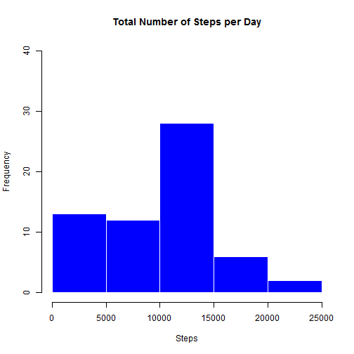
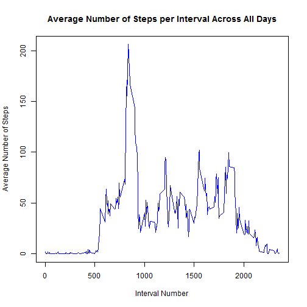
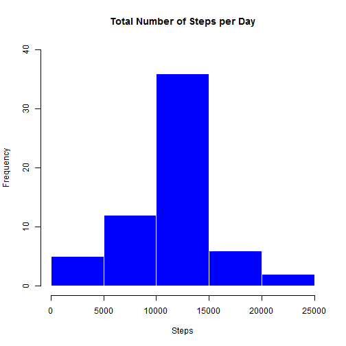
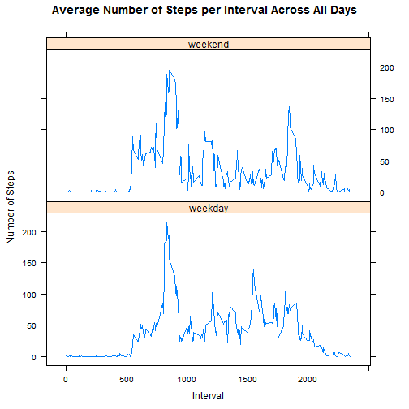

    # Reproducible Research: Peer Assessment 1
---
title: "PA1_template"
author: "JESALPCAS"
date: "Friday, September 12, 2014"
output:
  html_document:
    keep_md: true
---

To complete thisassesment it is necessary to actibate the following R libraries:

```r
op <- options(warn = (-1)) # suppress warnings turning off warnings as I still runing 3.0 version of R
library(plyr)
library(lattice)
options(op) # reset the default value, if you want 
```

## Loading and preprocessing the data
To load the data file use the following R statement. It is important to define the colClasses so the date column is loaded as such and not as a factor, which will be needed for later analysis.


```r
activity <- read.csv("c:/R/activity/activity.csv",as.is=T,colClasses=c("integer","Date","integer"))
```

## What is mean total number of steps taken per day?

To create a histogram of the total number of steps taken each day, the data file was first summarized by the total number of steps on a given date using the *ddply* function and the the histogram was plotted. Left scale was force to facilatate comparation on a later step.


```r
dataTot <- ddply(activity,c("date"),summarize, totsteps = sum(steps,na.rm=T))

hist(dataTot$totsteps, freq = T, col="blue", border="white",
     main="Total Number of Steps per Day", xlab="Steps",ylim = c(0,40))
```

 


The mean of the total number of steps taken per day is 9354.2295 and the median is 10395. Those values were calculated using the *mean* and *median* function as follow:


```r
mean(dataTot$totsteps)
median(dataTot$totsteps)
```

## What is the average daily activity pattern?

A time series plot of the 5-minute interval (x-axis) and the average number of steps taken, averaged across all days (y-axis) was created. In order to do that, the average steps interval was first calculated using the *ddply* function and the the plot was created using the remmary data resulting. 


```r
dataAve <- ddply(activity,c("interval"),summarize,
              meansteps = mean(steps,na.rm=T))

plot(dataAve,type="l",main="Average Number of Steps per Interval Across All Days",
     xlab="Interval Number",ylab="Average Number of Steps",col="blue")
```

 


From the summarized data calculated, it can also be observed that interval number 835 contains the maximum number of steps on average across all the days in the dataset. That value was extracted using the following R code:


```r
dataAve[which(dataAve$meansteps == max(dataAve$meansteps)),1]
```


## Imputing missing values


The original data set has missing values in 2304rows.  Which was calculated usig the *is.na* and *sum*functions as follows:


```r
numNA <- is.na(activity)
numNAs <- sum(numNA)
```

To overcome that situations the average number of steps per interval calculates on the privious step can be use to populate the missing values with data values that can be assumed as aproximatelly correct. 

To do that a copy of the origial data set was created *activityNoNA* and then the missing values were populated on it as priviously descrived using a *for* statement.


```r
activityNoNA <- activity
for(i in 1:nrow(activityNoNA)){
    if(numNA[i,1]){
        activityNoNA$steps[i] <- dataAve$meansteps[which(dataAve$interval == activityNoNA$interval[i])]
    }    
}
```

Summarizing this new updated data set and ploting the histogram again it can be observed a more normal behavior with a clearer single mode distribution toward the mean value.  


```r
dataTotNoNA <- ddply(activityNoNA,c("date"),summarize, totsteps = sum(steps,na.rm=T))
hist(dataTotNoNA$totsteps, freq = T, col="blue", border="white",
     main="Total Number of Steps per Day", xlab="Steps",ylim = c(0,40))
```

 


Calculating the central values again, it can be observed that the mean of this updated data set is 1.0766 &times; 10<sup>4</sup>and the median value is 1.0766 &times; 10<sup>4</sup>, which are slidely higher than the previously calculated values and identical among themselves. These new valuaes were calculated as follows:


```r
mean(dataTotNoNA$totsteps)
median(dataTotNoNA$totsteps)
```


## Are there differences in activity patterns between weekdays and weekends?

A new factor variable was include on the updated data set with two levels - "weekday" and "weekend" indicating whether a given date is a weekday or weekend day.


```r
op <- options(warn = (-1)) # suppress warnings 
activityNoNA$daytype <- factor(weekdays(activityNoNA$date),
                               label=c("weekday","weekday","weekend","weekend","weekday","weekday","weekday"))
activityNoNA$daytype <- factor(activityNoNA$daytype)
options(op) # reset the default value, if you want 
```

Ploting the 5-minute interval (x-axis) and the average number of steps taken, averaged across all weekday days or weekend days (y-axis) by the new variable just added, it can be observed that weekend days present higher activity than weekdays.


```r
dataAveNoNA <- ddply(activityNoNA,c("interval","daytype"),summarize,
                     meansteps = mean(steps,na.rm=T))

xyplot(meansteps ~ interval | daytype, data = dataAveNoNA, layout = c(1,2), type = "l",
       main="Average Number of Steps per Interval Across All Days",xlab="Interval",ylab="Number of Steps")
```

 
